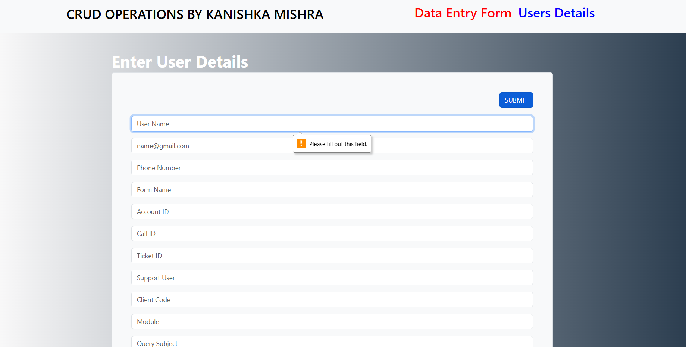
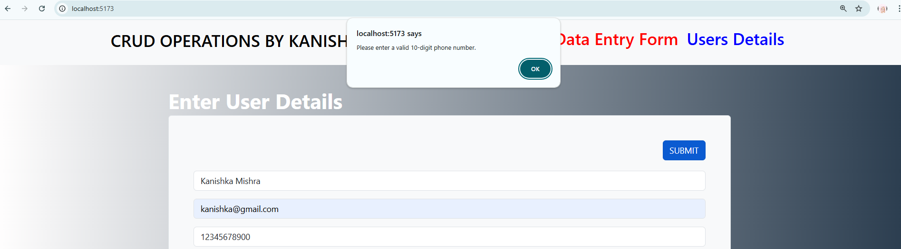

# Dynamic Dashboard with CRUD Operations

The Dynamic Dashboard is an interactive application built using React that allows users to seamlessly view, create, update, and manage records. The dashboard includes features for data visualization, sorting, filtering, and CRUD operations through API integration using Axios. This project demonstrates responsive design for optimal usability on both desktop and mobile devices.

## Features

#### 1. Data Visualization
- Displays JSON data in a structured format using tables.
- Supports sorting and filtering options to enhance data interaction.

#### 2. CRUD Operations
- Implements API operations (GET, POST, PATCH) using Axios.
- Includes modals for adding and editing records.

#### 3. User Feedback
- Provides user-friendly feedback for all interactions.
- Displays success messages for successful actions and appropriate error messages for failures.

#### 4. Responsive Design
- Clean and responsive UI for easy navigation and use.
- Optimized for viewing and interaction on both desktop and mobile screens.


## Technologies Used

- **React**: A powerful JavaScript library used for building dynamic and interactive user interfaces. With its component-based architecture, React simplifies the development of reusable UI components, enabling efficient updates and rendering of views in response to data changes. It supports features like hooks for managing state and lifecycle methods.
  
- **Axios**:  versatile and promise-based HTTP client for making API requests. Axios simplifies communication with the backend by providing intuitive methods for handling GET, POST, PUT, DELETE, and other HTTP methods. It supports request and response interception, automatic JSON data transformation, and error handling, enabling seamless integration between the frontend and backend services.
  
- **CSS**: A cornerstone technology for styling web applications. CSS (Cascading Style Sheets) is used to define the visual presentation of HTML elements, including layout, colors, fonts, and responsive design. Advanced features like Flexbox, Grid, and media queries allow for creating modern, adaptable designs that ensure consistent user experiences across devices and screen sizes.


## Installation

1. **Clone the Repository**
   ```bash
   https://github.com/kanishka-mishra/codeplayers_project.git
   
2. **Navigate to the project directory:**
   ```bash
   cd codeplayers_project

3. **cd react-shopping-cart:**
   ```bash
   npm install

4. **Start the development server:**
   ```bash
   npm start

## Screenshots

1. **Dashboard View:** 
The CRUD application interface features a clean layout with a header for navigation. and a main content area Where Users can create/add via forms with validation.
   

---

---

2. **Edit Interface** Edit interface enables CRUD operations, allowing users to modify fetched data, It is a main content area displaying records in a sortable, searchable table. Notifications provide feedback for all operations, ensuring a user-friendly experience.
   

---

---
##### Search Data By User_Name, Status_Date

---

---
##### Edit and delete specific records using buttons. Clicking the edit button enables the update button for making changes.

---
3. **Validations:** Fields include validation to ensure accurate input, displaying success messages for successful actions and appropriate error messages for any failures.
   

---
##### Some fields have validation and cannot be left empty.

---

---

---


      
## Development Process

- **Initial Setup**: Created a React app using create-react-app to quickly scaffold the project structure. Installed and configured Axios for HTTP requests, allowing for easy communication with a backend API or server to handle data fetching and manipulation. This setup enabled centralized API management and simplified the process of interacting with various endpoints.

- **Fetch Data**: Implemented functionality to asynchronously fetch data from either a local JSON file or a remote API using Axios. Managed responses with state management in React (using useState and useEffect hooks) and displayed the fetched data in relevant components. Incorporated error handling (like displaying error messages) for improved user experience, especially in cases of failed data fetches.

- **CRUD Operations**: Built full CRUD functionality for managing user records. For Create operations, developed a form to add new user details and submitted them to a backend. For Read operations, the user data was fetched and displayed in a list format. Implemented an Edit feature that allowed the user to modify existing records and a Delete feature to remove unwanted records. Validations were added to ensure data integrity, and UI elements provided feedback (e.g., success or error messages).

- **Responsive Design**: Used CSS techniques, including flexbox and grid layouts, along with media queries to ensure the app was responsive across different devices, such as mobiles, tablets, and desktops. The goal was to create a seamless, user-friendly interface that adjusts layout, font sizes, and button sizes for optimized use on various screen sizes.


---
## Contact
- Name: Kanishka Mishra
- Email: drkanishkamishra@gmail.com
- GitHub: https://github.com/kanishka-mishra

---
Thank you for exploring My Dynamic Dashboard Project!
